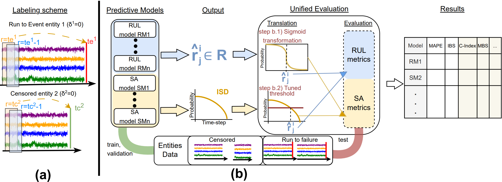
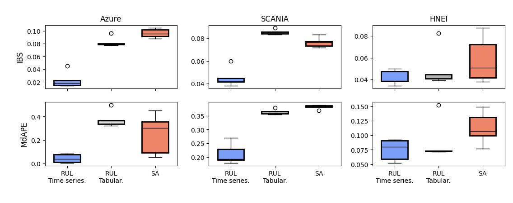

# On Model Selection for Time to Event Tasks.



This repository provides the implementation of a unified experimental and evaluation 
framework for 
regression **Remaining Useful Life (RUL)** prediction and **Survival Analysis (SA)** models. 
It supports consistent training, validation, testing, and comparison of regression 
and survival analysis
models across multiple datasets, with all results tracked via **MLflow**.

---
## Documentation
- For running on your own dataset [Documentation/run_on_your_own_dataset.md](Documentation/run_on_your_own_dataset.md)
- For using your own model [Documentation/Add_Method.md](Documentation/Add_Method.md)

## Environment Setup

The project uses **conda** for environment management.

### Create the Environment

To create the default (CPU-based) environment with all required dependencies, run:

```bash
conda env create -f environment.yml
conda activate unifiedSA
```

> **Note**: For GPU-enabled environments, see the **GPU Support** section at the end of this README.

---

### Data

Download the zip file containing the preprocessed datasets 
from [this link](https://drive.google.com/file/d/1nTtM-EyTJoMZPveRrjDHXc1TLWQ7sGs0/view?usp=sharing) 
and extract its contents into the `Data/` directory of the repository.

Datasets included:
- HNEI data from [here](https://github.com/ignavinuales/Battery_RUL_Prediction/tree/main/Datasets/HNEI_Processed)
- Azure data from [here](https://www.kaggle.com/datasets/arnabbiswas1/microsoft-azure-predictive-maintenance)
- SCANIA data from [here](https://researchdata.se/en/catalogue/dataset/2024-34)


## Experiment Tracking with MLflow

All experiment results (training, validation, and test) are logged using **MLflow**.

### Start MLflow Locally

Before running experiments or generating plots, start the MLflow server (dont forget to run fix_mlflow_paths.py to set correct paths on mflflow artifacts-figures) by executing:

```bash
conda activate unifiedSA
python fix_mlflow_paths.py
mlflow server --host 0.0.0.0 --port 5011 --backend-store-uri ./mlrunsp
```

Then open your browser and navigate to:

```
http://localhost:5011
```

---

## Plotting and Result Exploration

The `plot_utils.py` script provides a command-line interface (CLI) for generating all evaluation figures used in the study. All plots assume that the MLflow server is already running.

### Usage

```bash
python plot_utils.py --plot <plot_name>
```

### Available Plots

| Plot name (`--plot`) | Description                                                                                                  |
| -------------------- |--------------------------------------------------------------------------------------------------------------|
| `global`             | Global performance comparison of predictive models (MBS, IBS, MdAPE, MAPE) on AZURE and SCANIA datasets      |
| `calibration`        | Analysis of calibrated thresholding for deriving RUL predictions from ISDs (See Fixed Threshold experiments) |
| `bins`               | MdAPE analysis per RUL bin for AZURE and SCANIA datasets                                                     |
| `datasets`           | Dataset label statistics and descriptive plots                                                               |
| `hm_sigmoid`         | Statistical comparison between Hard-Mapping and Sigmoid-based translations from RUL to ISD                   |
|`family_box`| Boxplots comparing model families (Time-seris RUL,Tabular RUL, SA)                                           |
|`latex_table`| Produces the latex table with perfomrance results of all methods in the three examined datasets              |

### Example

Generate the global performance comparison figure:

```bash
python plot_utils.py --plot family_box
```



---

## Running Experiments

Running an experiment involves training the selected model on the training and validation 
sets (for hyperparameter optimization on 20 runs using bayesian optimization) and evaluating it on the test set.

* **Train–Validation results** are logged under:

  ```
  <RUL/SA> <dataset> <method> Train-Val
  ```
* **Test results** are logged under:

  ```
  <RUL/SA> <dataset> <method>
  ```

---

## RUL Prediction Experiments

RUL prediction experiments are executed using the `run_rul.py` script.

### Usage

```bash
python run_rul.py --dataset <dataset_name> --method_name <method_name>
```

### Arguments

* `--dataset`:

  * `Azure`
  * `SCANIA`

* `--method_name` (RUL models):

  * `XGBoost`
  * `CatBoost_W_RUL`
  * `RandomForestRUL`
  * `ElasticNetRUL`
  * `TABPFNv2` (To run TABPFNv2 comment out CatBoost_W_RUL in the script, as its imports are not compatible with TABPFNv2)
  * `sktimeLSTMFCN`
  * `sktimeInceptionTime`
  * `sktimeCNN`
  * `sktimeResNet`
  * `sktimeFCN`

### Example

```bash
python run_rul.py --dataset Azure --method_name XGBoost
```

---

## Survival Analysis (SA) Experiments

Survival Analysis experiments are executed using the `run_sa.py` script.

### Usage

```bash
python run_sa.py --dataset <dataset_name> --method_name <method_name>
```

### Arguments

* `--dataset`:

  * `Azure`
  * `SCANIA`

* `--method_name` (SA models):

  * `CoxPH`
  * `DeepHit`
  * `RDSM`
  * `RSF`

### Example

```bash
python run_sa.py --dataset SCANIA --method_name CoxPH
```

---
## Censoring Experiments

**For RUL Models**
```bash
python censoring_rul_experiment.py --method_name <method_name> --level <level> --dataset_version <method_name>
```
**For SA Models**
```bash
python censoring_rul_experiment.py --method_name <method_name> --level <level> --dataset_version <method_name>
```

**Arguments**

* `--method_name`: same as before for RUL and SA models
* `--level`: Level of censoring to apply (1,2,3) corresponding to 25%, 50%, and 75% censoring
* `--dataset_version`: which of the five versions of the datasets to use (1,2,3,4,5)

**Generating Figure 8**
```bash
python censoring_plot.py
```
## Fixed Threshold experiments

Running the below script will create a new experiment in mlflow with the name in form:`SA <dataset>05 <method_name>`.
```bash
python SA_threshold_test.py --method_name <method_name> --dataset <dataset>
```

```bash
python plot_utils.py --plot calibration
```

## GPU Support

GPU-enabled environments are supported via dedicated conda environment files:

* `RUL_GPU.yml` – GPU support for RUL experiments (e.g., deep learning–based time-series models)
* `SA_GPU.yml` – GPU support for Survival Analysis experiments

To create a GPU-enabled environment, run:

```bash
conda env create -f RUL_GPU.yml
# or
conda env create -f SA_GPU.yml
```

Make sure that:

* A compatible NVIDIA GPU is available
* NVIDIA drivers and CUDA are correctly installed on your system

Once created, activate the environment as usual:

```bash
conda activate <environment_name>
```

## 🎉 Acknowledgement
We appreciate the following github repos a lot for their valuable code base:
* https://github.com/ARM-software/mango